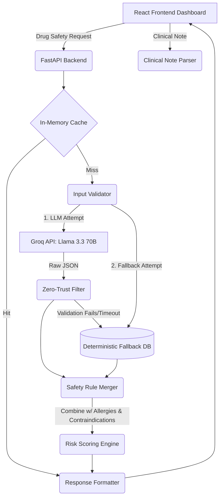

<div align="center">
  
# 🏥 Clinical Drug Safety Engine (CDSS)

**A Production-Grade Clinical Decision Support System (CDSS)**

[](https://reactjs.org/)
[](https://fastapi.tiangolo.com/)
[](https://groq.com/)
[](https://opensource.org/licenses/MIT)

*An educational demonstration of safely integrating Large Language Models (LLMs) into high-stakes clinical informatics pipelines using zero-trust architecture, deterministic fallbacks, and real-time processing.*

---
</div>

## 📖 Executive Summary

The **Clinical Drug Safety Engine** is a comprehensive, open-source Clinical Decision Support System (CDSS) designed to assist medical prescribers. By analyzing proposed medications against a patient's medical history, current medications, and known allergies, the system provides real-time safety assessments to prevent Adverse Drug Events (ADEs).

This project demonstrates how to build **"Fail-Safe AI"** in healthcare. It uses a powerful cloud-based LLM (Llama 3.3 70B via Groq) for dynamic interaction discovery, wrapped in a rigid, deterministic safety envelope that prevents hallucinations and guarantees a reliable output even if the AI fails.

---

## 🚀 Key Features

### 🖥️ Frontend Dashboard (React + Vite + Tailwind CSS 4)
- **Interactive Workspace**: Dual input modes featuring a manual medication form and an NLP-powered Clinical Notes chat interface.
- **Real-Time Risk Scoring**: Dynamic visualization of patient risk using a weighted component model (Interactions, Allergies, Contraindications).
- **Audit & Export**: Local history tracking of all checks and one-click PDF clinical report generation for medical records.
- **Medical-Grade UI**: Built with Shadcn/ui and Radix primitives, featuring a custom clinical design system (`oklch` color tokens, accessible contrast, fail-safe mode toggles).

### ⚙️ Backend Engine (FastAPI + Python)
- **Hybrid Intelligence**: Combines Llama 3.3 70B reasoning for complex drug-drug interactions with hardcoded deterministic rules for allergies and contraindications.
- **Zero-Trust Validation**: All LLM outputs are strictly typed and validated via Pydantic. Hallucinations (e.g., inventing drug names) are automatically stripped.
- **Deterministic Fallback**: If the LLM is unreachable, rate-limited, or fails validation, the system instantly hot-swaps to a local rule-based database to ensure the prescriber is never left without an answer.
- **NLP Note Parsing**: Extracts structured medical entities (medicines, conditions, vitals) from unstructured free-text clinical notes.

---

## 🏗️ System Architecture

The architecture is designed around the principle of **Defense in Depth**. The AI is treated as an untrusted microservice.



---

## 🔬 Educational Value: Building "Safe" AI in Healthcare

This repository serves as a blueprint for safe AI deployment in clinical settings:

1. **The Fallacy of Pure LLMs**: LLMs are probabilistic and prone to hallucination. This system demonstrates that LLMs should *inform* but not *decide*.
2. **Deterministic Envelopes**: While the LLM identifies potential drug-drug interactions, known allergies and condition contraindications (e.g., Asthma + Beta Blockers) are checked using 100% deterministic, hardcoded rules.
3. **Graceful Degradation**: The system guarantees a response. If the Groq API goes down, the backend catches the failure and serves safety data from `fallback_interactions.json`.
4. **Data Sanitization**: The LLM is forced to output JSON. The backend then filters the JSON, discarding any identified drugs that were not explicitly in the user's original input prompt.

---

## 🛠️ Quick Start Guide

### Prerequisites
- **Node.js 18+** & npm
- **Python 3.10+**
- **Groq API Key** (Free at [console.groq.com](https://console.groq.com))

### 1. Backend Setup
```bash
# Navigate to backend and install dependencies
cd backend
pip install -r requirements.txt

# Configure Environment
cp .env.example .env
# Open .env and add your Groq API Key: GROQ_API_KEY=gsk_...

# Start the FastAPI Server (runs on port 8000)
python -m uvicorn main:app --host 0.0.0.0 --port 8000 --reload
```

### 2. Frontend Setup
```bash
# Navigate to frontend and install dependencies
cd frontend
npm install

# Start the Vite Dev Server (runs on port 5173)
npm run dev
```
Navigate to **http://localhost:5173** in your browser to access the CDSS Dashboard.

*(Windows users can simply run the `start.bat` script in the root directory to launch both servers simultaneously).*

---

## 🧪 Testing

The backend includes a comprehensive test suite (69 test cases) that validates edge cases, fallback triggering, and hallucination filtering.

```bash
cd backend
pytest tests/test_engine.py -v
```

---

## 📚 API Reference

The backend exposes a documented, interactive Swagger UI at `http://localhost:8000/docs`.

| Endpoint | Method | Purpose |
|----------|--------|---------|
| `/api/v1/drug-safety/check` | `POST` | Core analysis of proposed medicines against patient history. |
| `/api/v1/clinical-notes/parse` | `POST` | NLP extraction of entities from free-text notes. |
| `/health` | `GET` | System status, LLM availability, and component checks. |
| `/api/v1/system-info` | `GET` | Detailed engine configuration and safety guarantees. |

---

<div align="center">
  <i>Developed for educational purposes in Clinical Informatics and AI Safety. <br>Not intended for actual medical diagnosis or treatment without professional review.</i>
</div>
